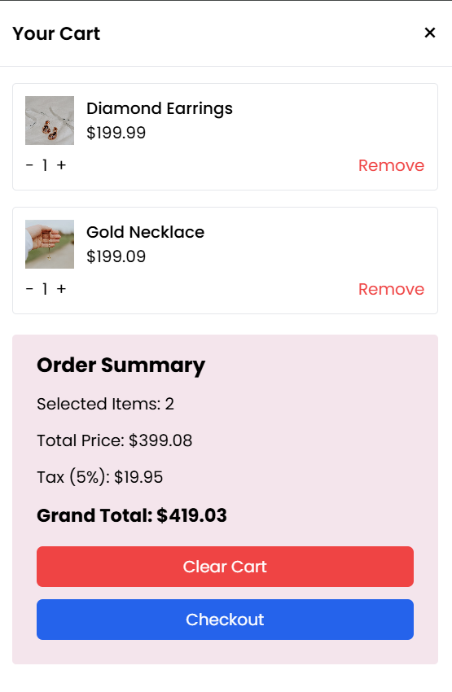
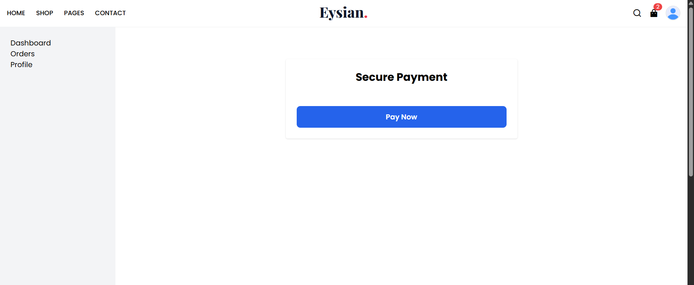
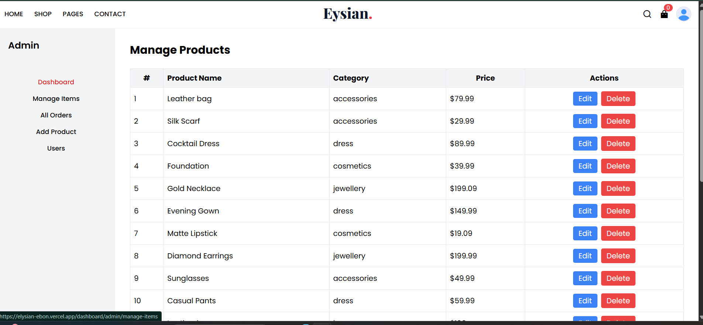

# ✨ ELYSIAN – Full Stack Fashion E-Commerce Platform

ELYSIAN is a modern full-stack fashion e-commerce platform built using the MERN stack. The application provides a seamless shopping experience with secure authentication, product management, shopping cart functionality, order management, and Stripe payment integration.

## 🌐 Live Demo

Frontend: https://elysian-ebon.vercel.app

Backend API: https://elysian-2hml.onrender.com

---

## 📸 Features

### 👤 Authentication & Authorization
- User Registration
- User Login & Logout
- JWT Authentication
- Secure HTTP-only Cookies
- Role-Based Access Control
- Admin & User Dashboards

### 🛍️ Product Management
- Browse Products
- Product Categories
- Product Filtering
- Product Details Page
- Related Products
- Product Reviews
- Product Ratings

### 🛒 Shopping Cart
- Add to Cart
- Remove from Cart
- Update Quantity
- Cart Summary
- Tax Calculation
- Grand Total Calculation

### 💳 Payments
- Stripe Payment Integration
- Secure Checkout
- Payment Confirmation
- Order Creation After Successful Payment

### 📦 Order Management
- View User Orders
- Order History
- Order Status Tracking
- Admin Order Management

### 👨‍💼 Admin Panel
- Manage Products
- Add Products
- Edit Products
- Delete Products
- Manage Orders
- Manage Users
- Update User Roles

---

## 🛠️ Tech Stack

### Frontend
- React.js
- React Router
- Redux Toolkit
- RTK Query
- Tailwind CSS
- Stripe React SDK
- React Hot Toast

### Backend
- Node.js
- Express.js
- MongoDB Atlas
- Mongoose
- JWT Authentication
- Cookie Parser
- CORS

### Payment Gateway
- Stripe

### Deployment
- Frontend: Vercel
- Backend: Render
- Database: MongoDB Atlas

---

## 📂 Project Structure

```
ELYSIAN/
│
├── frontend/
│   ├── src/
│   ├── public/
│   └── package.json
│
├── backend/
│   ├── src/
│   ├── middleware/
│   ├── models/
│   ├── routes/
│   └── package.json
│
└── README.md
```

---

## 🚀 Installation

### Clone Repository

```bash
git clone https://github.com/TanviKrishnan2005/ELYSIAN.git
cd ELYSIAN
```

---

## Backend Setup

```bash
cd backend
npm install
```

Create a `.env` file:

```env
DB_URL=your_mongodb_connection_string
JWT_SECRET_KEY=your_jwt_secret
STRIPE_SECRET_KEY=your_stripe_secret
STRIPE_WEBHOOK_SECRET=your_webhook_secret
PORT=5000
```

Run Backend:

```bash
npm start
```

---

## Frontend Setup

```bash
cd frontend
npm install
```

Create `.env`:

```env
VITE_STRIPE_PUBLISHABLE_KEY=your_publishable_key
```

Run Frontend:

```bash
npm run dev
```

---

## 🔐 Environment Variables

### Backend

```env
DB_URL=
JWT_SECRET_KEY=
STRIPE_SECRET_KEY=
STRIPE_WEBHOOK_SECRET=
PORT=
```

### Frontend

```env
VITE_STRIPE_PUBLISHABLE_KEY=
```

---

## 📈 Future Enhancements

- Wishlist Functionality
- Product Search
- Product Image Uploads
- Email Notifications
- Coupon System
- Inventory Management
- Sales Analytics Dashboard
- Multi-Payment Support

---

## 🎯 Learning Outcomes

This project helped strengthen my understanding of:

- Full Stack MERN Development
- REST API Design
- JWT Authentication
- State Management with Redux Toolkit
- RTK Query
- MongoDB Data Modeling
- Payment Gateway Integration
- Deployment & Production Debugging
- Role-Based Access Control
- Real-World E-Commerce Architecture

---


## 📸 Project Preview

| Home Page | Shop Page |
|-----------|-----------|
|  |  |

| Shopping Cart | Payment |
|---------------|---------|
|  |  |

| Admin Dashboard |
|-----------------|
|  |

## 👩‍💻 Author

**Tanvi Lekshmi RM**

GitHub:
https://github.com/TanviKrishnan2005

---
